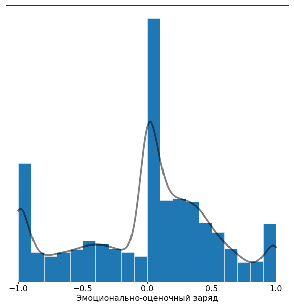

# Тональный словарь русского языка КартаСловСент

Датасет включает в себя слова и выражения русского языка, снабжённые тональной меткой («положительное», «отрицательное», «нейтральное») и скалярным значением эмоционально-оценочного заряда из непрерывного диапазона [-1, 1].

## Объём датасета

Общий объём — 46127 записей.

| Метка  | Объём |
| ------------- | ------------- |
| Положительное | 6215 записей |
| Отрицательное | 11863 записей |
| Нейтральное | 28049 записей |

## Формат датасета
Файл датасета `kartaslovsent.csv` имеет формат CSV, разделитель точка с запятой, кодировка UTF-8.

## Структура записи датасета

| Поле  | Комментарий | Источник
| ------------- | ------------- | ------------- |
| term  | слово или словосочетание (обобщённо «вход»)  | входные данные
| tag | метка тональности: PSTV («положительное»), NGTV («отрицательное»), NEUT («нейтральное»)  | формула
| value | скалярное значение эмоционально-оценочного заряда из непрерывного диапазона [-1, 1], где +1 соответствует входам с максимально положительной окраской, -1 — входам с максимально отрицательной окраской, 0 — входам с нейтральной окраской (то же, что отсутствие окраски)    | формула
| pstv | доля голосов за положительную тональность  | исходная разметка
| ngtv | доля голосов за отрицательную тональность  | исходная разметка
| neut | доля голосов за нейтральную тональность  | исходная разметка
| dunno | доля голосов «не знаю»  | исходная разметка
| pstvNgtvDisagreementRatio | показатель рассогласованности между голосами за положительную/отрицательную тональность, 0 соответствует отсутствию рассогласованности, 1 — максимальной рассогласованности | формула

Значения `pstv`, `ngtv`, `neut` и `dunno` округлены до трёх знаков после запятой (десятая доля процента), сумма значений равна единице.

Поля `value`, `tag` и `pstvNgtvDisagreementRatio` вычисляются по формуле на основе данных исходной разметки. Значение `value` и `pstvNgtvDisagreementRatio` округлены до двух знаков после запятой.   

Поле `tag` рассчитывается из `value` по следующему принципу:

| tag  | Условие |
| ------------- | ------------- |
| PSTV | value >= 0.55  |
| NEUT | value ∈ (-0.35, 0.55)  |
| NGTV | value <= -0.35  |

### Распределение значений поля `value`

### Исходная разметка
Датасет размечается краудсорсингом. В процессе разметки отвечающему предлагается оценить то или иное слово как нейтральное, положительное или отрицательное. Также предусмотрен ответ «не знаю».
 
 Датасет содержит обобщённые данные исходной разметки, включающие количественное соотношение голосов, отданных за каждый из вариантов. Сумма значений `pstv`, `neut`, `ngtv` и `dunno` равняется единице (100% голосов).
 
 Значение поля `pstvNgtvDisagreementRatio` приводится для удобства и является показателем рассогласованности между голосами за положительную/отрицательную тональность. Чем выше значение показателя, тем выше рассогласованность. С практической точки зрения высокая рассогласованность обозначает, что тональность слова сильно зависит от контекста и/или от внеязыковой ситуации и положения наблюдателя в ней.
 
 Пользователю предлагается использовать приведённые предрассчитанные показатели `value`, `tag` и `pstvNgtvDisagreementRatio` или рассчитать их самостоятельно на основе собственной модели.

### Предыдущие версии датасета

Ссылки на предыдущие версии датасета приводятся для исторических целей, а также для использования в работах, опирающихся на конкретную версию данных.

[Версия от ноября 2019 года]

[Версия от декабря 2018 года]

## Научная статья и цитирование

В настоящий момент статья находится в процессе публикации. Для получения препринта напишите нам на kartaslov@mail.ru.

## Лицензия

Данный датасет распространяется по лицензии [CC BY-NC-SA 4.0]. Простыми словами — вы можете свободно использовать его в личных, научных, исследовательских и любых других целях, не подразумевающих получения дохода коммерческим путём. При этом от вас требуется указать ссылку на лицензию и на этот репозиторий. Производные работы должны распространятся под аналогичной лицензией.

Будем признательны, если вы скинете несколько строк на kartaslov@mail.ru о том, как вы планируете использовать датасет — нам это интересно, как исследователям, и поможет сделать датасет лучше в будущем.

По вопросам использования датасета в коммерческих целях смотрите развёрнутый комментарий: [использование данных в коммерческих целях].

[использование данных в коммерческих целях]: <../../readme/commercial_use.md>
[CC BY-NC-SA 4.0]: https://creativecommons.org/licenses/by-nc-sa/4.0/
[Версия от декабря 2018 года]: <../emo_dict_history/v1_2018_dec>
[Версия от ноября 2019 года]: <../emo_dict_history/v2_2019_nov>