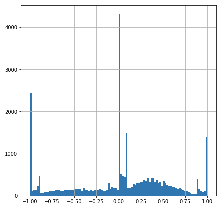

# Тональный словарь русского языка

В датасете представлен тональный словарь русского языка: слова РЯ, снабжённые метками полярности и силы эмоционально-оценочного заряда.

## Формат датасета
Файл датасета имеет формат CSV, разделитель точка с запятой, кодировка UTF-8.

## Структура записи

| Поле  | Комментарий | Источник
| ------------- | ------------- | ------------- |
| term  | слово или словосочетание (обобщённо «терм»)  | входные данные
| tag | оценка (метка полярности): PSTV, NEUT, NGTV  | формула
| value | полярность в диапазоне [-1, 1], где +1 соответствует словам с максимально положительной окраской, 0 — словам с нейтральной окраской, а -1 — словам с максимально отрицательной окраской    | формула
| pstv | доля голосов за положительную оценку  | исходная разметка 
| neut | доля голосов за нейтральную оценку  | исходная разметка
| ngtv | доля голосов за отрицательную оценку  | исходная разметка
| dunno | доля голосов «не знаю»  | исходная разметка
| distortion | показатель неуверенности между положительной и отрицательной оценками | формула

Поля `value`, `tag` и `distortion` вычисляются по формуле на основе данных исходной разметки.

Поле `tag` рассчитывается из `value` по следующему принципу:

| tag  | Условие |
| ------------- | ------------- |
| PSTV | value >= 0.55  |
| NEUT | value ∈ (-0.35, 0.55)  |
| NGTV | value <= -0.35  |

## Объём датасета

| tag  | Объём |
| ------------- | ------------- |
| NEUT | 16873  |
| NGTV | 6774  |
| PSTV | 4550  |

Общий объём — 28197 слов.

### Распределение полярностей

### Исходная разметка
Датасет собирается краудсорсингом. В процессе разметки отвечающему предлагается оценить то или иное слово как нейтральное, положительное или отрицательное. Также предусмотрен ответ «не знаю».
 
 В данной версии датасета публикуются обобщённые данные исходной разметки, включающие количественное соотношение голосов, отданных за каждый из вариантов. Сумма значений `pstv`, `neut`, `ngtv` и `dunno` равняется единице (100% голосов).
 
 Значение поля `distortion` приводится для удобства и является мерой рассогласованности разметки между положительной и отрицательной оценками. Чем выше значение показателя, тем выше рассогласованность. С практической точки зрения это обозначает, что оценка слова сильно зависит от контекста или от внеязыковой ситуации и положения наблюдателя в ней.
 
 Пользователю предлагается использовать приведённые предрассчитанные показатели `value`, `tag` и `distortion` или рассчитать их самостоятельно на основе собственной модели.

### Отличие от предыдущей версии датасета и ссылка на неё

[Предыдущая версия датасета] содержала бóльшее количество слов, а также включала в себя 11860 выражений русского языка.
 
 Задачей текущей версии было уточнение разметки для наиболее узнаваемых и частоупотребимых слов РЯ. Объём словника был уменьшен за счёт исключения малораспространённых и/или малознакомых слов. Словосочетания не участвовали в разметке; они будут возвращены в будущих версиях датасета.
 
 Также в настоящей версии датасета приводятся данные исходной разметки, которые можно использовать в собственных моделях расчёта полярности и меры согласованности оценок.

## Лицензия

Данный датасет распространяется по лицензии [CC BY-NC-SA 4.0]. Простыми словами — вы можете свободно использовать его в личных, научных, исследовательских и любых других целях, не подразумевающих получения дохода коммерческим путём. При этом от вас требуется указать ссылку на лицензию и на этот репозиторий. Производные работы должны распространятся под аналогичной лицензией.

Будем признательны, если вы скинете несколько строк на kartaslov@mail.ru о том, как вы планируете использовать датасет — нам это интересно, как исследователям, и поможет сделать датасет лучше в будущем.

По вопросам использования датасета в коммерческих целях смотрите развёрнутый комментарий: [использование данных в коммерческих целях].

[использование данных в коммерческих целях]: <../../readme/commercial_use.md>
[CC BY-NC-SA 4.0]: https://creativecommons.org/licenses/by-nc-sa/4.0/
[интерактивном навигаторе]: https://research.kartaslov.ru/
[Предыдущая версия датасета]: <../emo_dict_history/v1_2018_dec>